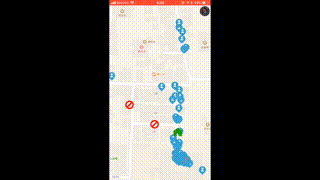

# evacuation-route-visualizer

## スクリーンショット


## 概要
災害時の情報共有の実験を目的とした、スマホ用でもアプリです。複数人での、位置共有などが可能です。また、移動経路や、避難者（ユーザ）の属性情報を記録したファイルをアップロードして保存することもできます。

## 使い方
後述する仕様を満たすようなAPIサーバを準備してアプリを起動してください。アプリが起動されると、端末ごとに自動で移動経路のログが記録されます。ログファイルは、画面上を2本指で5回連続タップすることで、アップロードすることができます。

## API仕様
以下のAPIが実装されたAPIサーバを用意してください。   
（サンプルは[こちら](https://github.com/prog470dev/evacuation-route-visualizer-back-sample)）
### Get User
全ユーザの情報を取得します。
#### URL
`GET /user`
#### Response Example
```json
[
    {
        "id": "A8322A00-163F-403F-8A33-18EFADEF67E3",
        "latitude": 36.543823,
        "longitude": 136.70459,
        "type": 0
    },
    {
        "id": "xxx_test_user_X",
        "latitude": 36.544456,
        "longitude": 136.7063,
        "type": 0
    }
]
```

### Set User
アプリが動作している端末のユーザー情報を登録・更新します。
#### URL
`POST /user`
#### Example
```json
{
  "id":"",
  "latitude":"35.6895",
  "longitude":"139.6917",
  "type":"1"  
}
```
#### Response Example
ステータスコードのみ

### Upload Log
端末の経路情報ログファイルをアップロードします。
#### URL
`POST /log`
#### Example
CSV形式のファイルをアップロード
#### Response Example
ステータスコードのみ

## テーブルスキーマ例
以下のDDLで定義されるテーブルを想定しています。
### DDL
```
CREATE DATABASE app;
CREATE TABLE app.users (id INT, latitude DOUBLE, longitude DOUBLE, type INT);
ALTER TABLE goapp.users ADD PRIMARY KEY(id(255));
```
